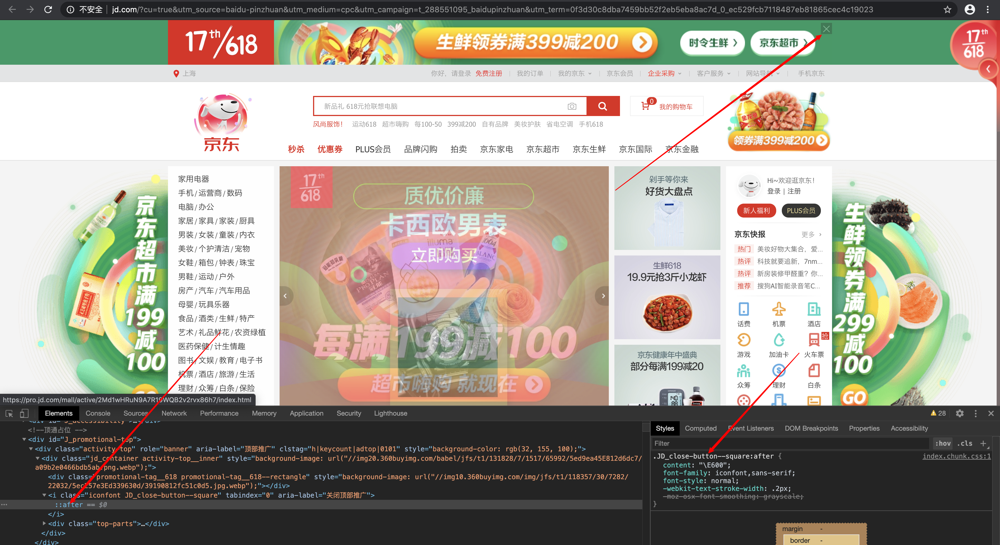
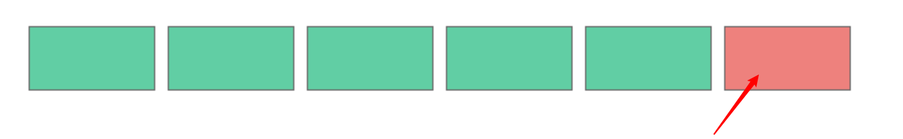
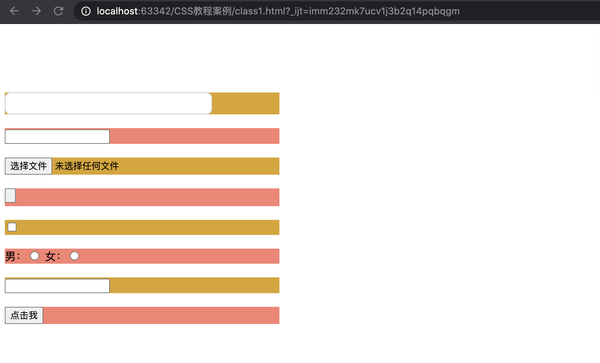
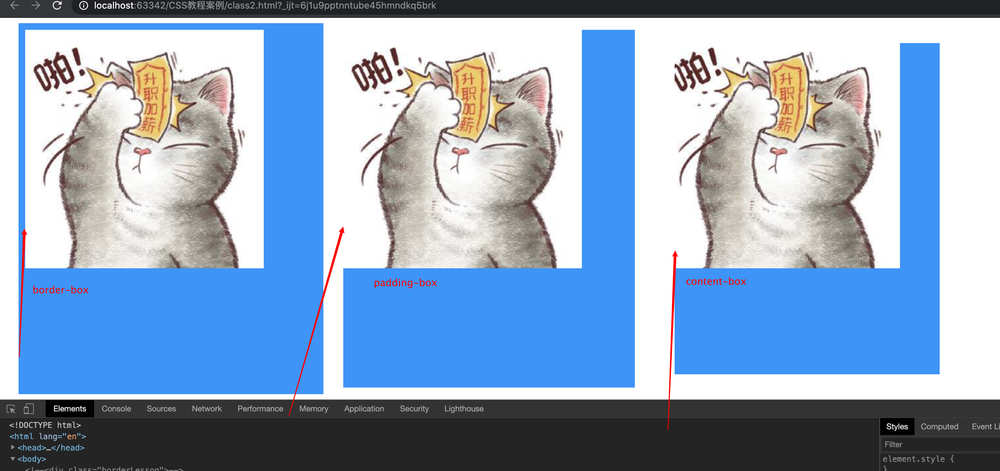

##                                                       CSS3 入门教程

### 课程导学

 Hi，同学你好～，欢迎进入CSS3入门教程，我是CSS3入门教程的老师ghost（丑鬼）。很开心接下来的课程我与大家一起以互动编程的方式一起起学习CSS3。由于我们不是面对面的教学，所以祝你上午好，下午好。

首先考虑一下CSS3是什么呢？都有CSS2了为啥还要使用这个CSS3？

其实从名字上就不难看出，CSS3其实就是CSS的技术升级版本，在编程开发以及工作原理上，其实CSS3与CSS都是相差无几的，但是CSS3在CSS的基础上，新增了一些功能，使得css3在辅助开发者进行开发与研发时，带来的作用更加大。并且CSS3还提供的动画特性，可让开发者在先实现一些动态按钮或者动态导航时远离JavaScript，让开发人员不需要花费大量的时间去写脚本或者寻找合适的脚本插件来适配一些动态网站效果。但是有意思的是CSS3并不是W3C规定的像CSS2.1那样的一个标准，只是社区里面的人把这些新特性叫做CSS3。相信后面还有CSS4·······

重要的 CSS3 模块包括：

- 选择器

- 框模型

- 背景和边框

- 文本效果

- 2D/3D 转换

- 动画

- 多列布局

- 用户界面

说了那么多，咱们看看企业里面真实的对前端开发的技能的要求：


相信大家看也会浏览招聘网站的招聘要求，基本上每一家的要求都会包含必须要精通CSS3。

我们来看一下经常使用的jd与tmall这些网站是不是也在使用CSS3呢？




可以说CSS3我们在项目中已经开始大量的使用，因为CSS3就像魔法一样，寥寥数行的代码就可以让你的网页脱胎换骨，焕然一新。但是CSS3应该说是一把双刃剑，使用好了会让你代码质量还有效率得到提高，那相应的你的薪资可能也会比别人要高哦，但是使用不好（在不支持CSS3新特性的浏览器中使用）会让你书写的代码呈现出很糟糕的效果。

CSS3 新特性非常多，本课程挑选一些被浏览器支持较为完美、更具实用性的新特性，分为八个部分与大家一起学习CSS3这些新的特性。相信聪明的你在学完本次课程以后会有下面的收获：

1. CSS3新特性

2. 工作中经常使用的CSS3与CSS编码技巧

3. 可以使用CSS3实现轮播的小案例

下面让我们开始学习CSS3这门课程的旅程，让我们一起升级carry全场吧！

### 一.  一级天赋树——CSS3选择器

我先简单介绍一下天赋树，天赋树又叫技能树，你每升一级就给你一个技能点，而技能树有几个专精方向，你所得的技能点只够加满一个专精方向，所以在你选择的时候就必须有所保留。但是也就是这一点，使玩家们八仙过海，各显神通。而同学们现在就是一个web成长方向的英雄，你的天赋树决定了你是不是够强大，carry全场。

给大家看一下sf的天赋树，大体有个概念这个东西是啥：


大家已经学习过了CSS2中的选择器的用法，CSS3在CSS2的基础上对属性选择器进行了扩展，新增了3大类选择器：

   1. 属性选择器

   2. 结构伪类选择器

   3. UI元素伪类选择器

  

对于CSS刚刚入门不久的同学，当接触到这么多选择器的时候，内心就会油然而生出一种怀疑：学这些选择器有用么？我只用id选择器、class选择器、群组选择器这几个就能独步江湖了，干嘛费心费力去学那么多选择器呢？

对于这种想法，我只能说一句：肤浅！

这些新增的选择器相对id选择器、class选择器来说，用的机会可能少一点，但是在实际开发中，却是非常非常实用的。使用新增的这些CSS3选择器，能够使我们操作元素更加方便，并且可以减轻id和class的泛滥成灾的现象。通过这章的学习，大家会慢慢见识到，不急哈。

CSS3中新增的这些选择器都非常重要，为了更好地帮大家学习和理解CSS3选择器，我们分3个章节来讲解，这样也方便大家日常到这里查询各种选择器的用法。

#####  1.  属性选择器

- **语法： **

   ```css
   1. E[attr^ = "val"]{
       // 选择元素E且有attr属性，并且属性是以val开头的所有元素;
     	// 简单记火车头开始的attr名val匹配
       }
   2. E[attr$="val"]{
       // 选择元素E有属性attr属性,并且属性是以val结尾的所有元素;
       // 简单记火车尾结尾的attr名字为val
       }
   3. E[attr *="val"]{
       //选择元素E有属性attr属性，并且属性包含val的所有元素;
       }
   ```

   

   为了更好的说明问题，我们创建几个DOM结构并添加样式看看他们是如何使用的。如下：
   
   - **源码：**

```html
<style>
  li[skill="fire"] {
      background-color: red;
    }

    li[color = "white"] {
      background-color: blue;
    }
    
    li[color~="red"] {
      background-color: orange;
    }
    
    li[color^="bla"] {
      border: 10px solid #0094ff;
    }
    
    li[color$="ge"] {
      font-size: 32px;
    }
    
    li[color*="orange"] {
      color: orange;
    }
    
    li[color|="black"] {
      background-color: black;
      color: #fff;
    }
  </style>
</style>
<body>
  <div>
    <ul>
      <li skill="fire">末日爸爸</li>
      <li color="black">影魔爸爸</li>
      <li color="white">美杜莎</li>
      <li color="blue red">敌法师</li>
      <li color="white gray">巨馍蘸酱</li>
      <li color="black-orange">米波</li>
  	</ul>
	</div>
   </body>
```


​      


 同学们可以自己亲手实践一下，不能光see，要自己动手才行幺。

##### 2.  结构伪类选择器

CSS3中推出了一些新的伪类选择器，我们着重讲几个经常在开发中用到的一些伪类选择器。使用这些选择器的时候需要注意如下问题：

【使用注意⚠️】
\* 标签E,必须是某个元素的子元素(在界面上)
\* 如果通过伪类选择器找到的元素不是`E`则选择无效

  - **语法：**

1. 结构伪类E:first-child：第一个子元素；

2. E:last-child：最后一个子元素；

3. E:nth-child(n)： 第n个子元素，计算方法是E元素的全部兄弟元素；

4. E:nth-last-child(n)： 跟E:nth-child(n)类似 ，只是倒着计算；

   $\color{red}{
         其中n的取值范围是：0,1,2,3,4...线性累加
         可以传入表达式，比如2n,2n+1等等
         可以传入特殊字符：even(偶数) odd(奇数)E:empty 指的是E标签，并且内容为空}$

5. E:not(选择器)：指的是，不满足括号内选择器条件的元素；

6. E:before：在元素E之前添加, E:after：在元素E末尾添加，也可以写为E::beforeE::after【**重要**】

7. E目标伪类E:target:选中当前锚点


我们先看一下这个东西别人是怎么使用的


大家看这是apple的官网，他们也在使用我们说的伪类选择器:last-child来为最后一个li元素设置margin-bottom为0。大家一定跃跃欲试，那么接下来让我们一一体会一下。

- **源码：**

**:first-child**

```css
div:first-child {
    background-color: var(--red);
}

```

```html
<div></div>
<div></div>
<div></div>
<div></div>
<div></div>
<div></div>
```


**:last-child **

```css
div:last-child {
    background-color: var(--red);
}

```

```html
<div></div>
<div></div>
<div></div>
<div></div>
<div></div>
<div></div>

```



**:nth-child**

```css

/*这个意思就是选择div 的父元素中的第一个为div 的子元素*/
div:nth-child(1){
      background-color: rebeccapurple;
    }
// 下面这两个分别是选择奇数和偶数子元素
div:nth-child(odd){
      background-color: #daa520;
    }
div:nth-child(even){
      background-color: salmon;
    }
```

分别看一下效果：




**:not**

`:not` 选择除某个元素之外的所有元素

```css
div {
    float: left;
    margin-left: 10px;
    width: 100px;
    height: 50px;
    border: var(--border);
    background-color: var(--green);
}
 
div:not(.item) {
    background-color: var(--red);
}

```

```html
    <div class="item"></div>
    <div class="item"></div>
    <div class="item"></div>
    <div class="item"></div>
    <div class="diff"></div>
    <div class="item"></div>

```


**PS:**   :not 可以配合其他选择器使用，例如： `div:not(:first-child){....}`。

**:before & :after**

【使用注意⚠️】：

- 需要配合`content`属性使用（如果没有,输入""空字符串）

- 可以用来制作图标

- 部分图标框架使用的就是这种机制

- 默认是行内元素，根据需求可能需要修改

为什么说这个东西很重要呢，一般我们在开发的时候会经常使用这个东西清除浮动，来看一下百度的清除浮动


每个公司都有自己清除浮动的代码，下面这段是我在工作中使用的清除浮动的方法

```css
/*清除浮动最现代、最流行、最简单的方式*/
.clearfix::before, .clearfix::after {
  content: "";
  display: table;
}

.clearfix::after {
  clear: both;
}

/*兼容IE67*/
.clearfix {
  *zoom: 1;
}
```

在实际的工作中还有一个重要的用途，有时候我们会图省事，直接使用这两个伪元素来画一个图形来实现一些特效：来看一下我简单写的一个例子：

```css
div:nth-child(1){
      background-color: rebeccapurple;
      position: relative;
    }
    div:nth-child(1)::before{
      position: absolute;
      content: "";
      width: 0px; /*设置宽高为0，让内容为空，从才能形成三角形尖角*/
      height: 0px;
      border-bottom: 20px solid #00a3af;
      border-left: 20px solid transparent;    /*transparent 表示透明*/
      border-right: 20px solid transparent;
      top: -60%;
      left: 0;
    }
```

```html
<div>
  <input type="text">
</div>
```


**:target** 

表示一个唯一的元素（目标元素），其ID与URL的片段匹配。

```css
#first:target {
    background-color: var(--red);
}
#second:target {
    background-color: var(--blue);
}
#third:target {
    background-color: var(--yellow);
}

```

```html
<a href="#first">first</a>
<a href="#second">second</a>
<a href="#third">third</a>
<div id="first"></div>
<div id="second"></div>
<div id="third"></div>

```


当然了除了上面我们常用的几个以外，还有两个不是经常使用的分别是：:root 与 :empty

根选择器 `:root` 匹配元素所在文档的根元素。在HTML文档中，根元素始终是`<html>`。

为空选择器:`:empty` 选择没有任何内容的元素(有空格也不行)。

##### 3. UI元素状态伪类

UI元素状态伪类一般我们是在form表单元素上经常使用，有些表单元素有可用（“:enabled”）和不可用（“:disabled”）状态，比如输入框，密码框，复选框等。在默认情况之下，这些表单元素都处在可用状态。那么我们可以通过伪选择器“:enabled”对这些表单元素设置样式。

总结一下就是：ui元素的状态一般包括 启用|禁用 选中|未选中 获得焦点|失去焦点

例如我们下面看到的小米官网的案例

**:focus**


**:checked**

接下来我们仿照这个写一个checkbox框如何使用状态伪元素改变自己的样式

```html
<html>
  <style>
     input[type="checkbox"] {
        height: 20px;
        width: 20px;
        outline: none;
        /*-webkit-appearance: none;*/
        margin: 0;
        padding: 0;
        border: 1px solid #cccccc;
      }

      input[type="checkbox"]:hover {
        outline: none;
      }

      input[type="checkbox"]:checked {
        border: 1px solid #cccccc;
        background-color: #00a3af;
      }
  </style>
<body>
 <div>
  <input type="checkbox">
</div>
</body>
  
</html>
```

剩下的那几个同学们自己去试试，俗话说师父领进门，修行靠个人。

##### 4.  案例与总结

我们做一个简单的例子，实现类似斑马线的效果

```html
<style>
   .clearfix::before, .clearfix::after {
      content: "";
      display: table;
    }

    .clearfix::after {
      clear: both;
    }
    
    /*兼容IE67*/
    .clearfix {
      *zoom: 1;
    }
    div{
      background-color: #696969;
      margin-top: 100px;
      width: 600px;
    }
    div ul{
      margin: 0 auto;
      padding: 0;
    }
    div ul li {
      float: left;
      height: 150px;
      width: 50px;
      list-style: none;
    }
    ul li:nth-child(odd){
      background-color: #fff;
    }
    ul li:nth-child(even){
      background-color: #696969;
    }
</style>
<body>
	<div>
      <ul class="clearfix">
        <li></li>
        <li></li>
        <li></li>
        <li></li>
        <li></li>
        <li></li>
        <li></li>
        <li></li>
        <li></li>
        <li></li>
        <li></li>
        <li></li>
      </ul>
  </div>
</body>

```


同学们没必要按照我这个写，只要把今天学的这些选择器结合你自己想法用起来就行。要学会举一反三。

【小提示！】

一定有同学和我当初学习的时候一样，什么是伪元素？什么是伪类啊？下面的地址很好的介绍了两者的区别

https://developer.mozilla.org/zh-CN/docs/Learn/CSS/Building_blocks/Selectors/Pseudo-classes_and_pseudo-elements 

$\color{#fbb405}{个人简单的理解：伪元素会在HTML文档中生成一个虚假的DOM（它只是表现的像而已）。伪类呢就是类似于类名选择器使用的非用户自己定义的类的选择器，而是选择处于特定状态的元素的选择器。}$

##### 5. 打野升级

利用今天学习的知识实现下面图片的效果


### 二.    二级天赋树——边框、背景、颜色

恭喜同学们进入了本层学习，从一级小仙升级成长为二级。在学习这些之前相信你已经学习并掌握了CSS的基础知识和上一层的技能，那么接下来我们会分三个部分来讲解CSS3几个关于边框、背景和颜色的新特性。

- **边框**

- **背景**

- **颜色**
##### 1. 边框（border） 

大家想一下在还没学习这个课程之前，假如让你设计一个带圆角的元素你怎么设计？是不是和我想的一样使用一个背景图片呀，或者是使用繁琐的元素拼凑出来呀。那相信你学完这节课以后发现这个东西原来这么简单就可以实现了～～

**border-radius**

这是CSS3新增加的圆角边框属性

- 语法
  - **四个值:** 第一个值为左上角，第二个值为右上角，第三个值为右下角，第四个值为左下角。
  - **三个值:** 第一个值为左上角, 第二个值为右上角和左下角，第三个值为右下角
  - **两个值:** 第一个值为左上角与右下角，第二个值为右上角与左下角
  - **一个值：** 四个圆角值相同


  border-radius:8px; 为一个元素所有角设置8px的圆角


  ```html
  <!DOCTYPE html>
  <html lang="en">
  <head>
    <meta charset="UTF-8">
    <title>Title</title>
  </head>
  <style>
    .borderLesson{
      height: 50px;
      width: 50px;
      border-radius: 8px;
      background-color:#00a3af;
    }
  </style>
  <body>
  
  <div class="borderLesson">
  
  </div>
  </body>
  </html>
  ```


border-radius:8px 5px 4px 2px; // 这代表四个角分别是左上角，右上角，右下角，左下角，顺时针方向。简单记就是：上右下左


【注意⚠️】不要以为border-raduis的值只能使用px单位，你还可以使用百分比或者em

**给同学们出个小小的问题，能不能利用这个属性制作一个圆呢，椭圆？**

你要是觉得CSS3就是增加一个这么，太简单了。别慌同学，咱接着看下面的属性。

**border-image**

border-image属性允许您指定图像以用作元素的边框。border-image属性是速记属性用于设置以下几个属性的:

- border-image-source(用于指定要用于绘制边框的图像的位置), 

- border-image-slice(图像边界向内偏移)

- border-image-width(图像边界的宽度)

- border-image-outset (用于指定在边框外部绘制 border-image-area 的量)

- border-image-repeat的(用于设置图像边界是否应重复（repeat）、拉伸（stretch）或铺满（round）)

  **注意**：省略的值设置为它们的默认值。
```css
.borderImg{
    margin: 0 auto;
    height: 200px;
    width: 200px;
    border: 15px solid transparent;
    border-image: url("images/3e959ea5f176a6b7.png") 25 15;
  }
```


【注意⚠️】

这个属性在IE浏览器中是不支持的。

同学们亲自试试吧！

**box-shadow**

box-shadow是向盒子添加阴影，支持一个或者多个。在开发中我们会使用这个属性来设置边框和阴影特效，所以我把这个属性放在边框这一章节。

- **语法**

  box-shadow: *h-shadow v-shadow blur spread color* inset;

  **注意：**boxShadow 属性把一个或多个下拉阴影添加到框上。该属性是一个用逗号分隔阴影的列表，每个阴影由 2-4 个长度值、一个可选的颜色值和一个可选的 inset 关键字来规定。省略长度的值是 0。

  | 值         | 说明                                                         |
  | :--------- | :----------------------------------------------------------- |
  | *h-shadow* | 必需的。水平阴影的位置。允许负值                             |
  | *v-shadow* | 必需的。垂直阴影的位置。允许负值                             |
  | *blur*     | 可选。模糊距离                                               |
  | *spread*   | 可选。阴影的大小                                             |
  | *color*    | 可选。阴影的颜色。在[CSS颜色值](https://www.runoob.com/cssref/css_colors_legal.aspx)寻找颜色值的完整列表 |
  | inset      | 可选。从外层的阴影（开始时）改变阴影内侧阴影                 |

来看一下小米官网是怎么使用的


小米在使用这个东西做了一个阴影的特效，让这一部分更有立体的效果。

一般我会使用这个属性在移动端设置1px 边框，代码如下：

```css
.boxShadow{
    height: 200px;
    width: 200px;
    margin: 300px auto;
    box-shadow: 0px -1px 1px -1px #888888 inset, /*上*/
                0px 1px 1px -1px #888888 inset, /*下*/
                -1px 0px 1px -1px #888888 inset,/*左*/
                1px 0px 1px -1px #888888 inset;/*右*/
  }
```


快来试试吧！不能光看，也要自己动手敲一敲，思维也别拘泥于老师说的这些，我只是举个例子，要学会自己思考。

##### 2.  CSS3背景 

CSS3 中包含几个新的背景属性，提供更多背景元素控制。

在本小节你将了解以下背景属性：

- background-origin

- background-clip

- background-size

我问大家一个问题吧，我记得有一个background-image，这个属性是CSS的还是CSS3的属性？

接下来我们一一看这些属性

**background-origin**

设置元素背景图片的原始起始位置

- 语法

  background-origin：border-box ｜ padding-box｜content-box

  参数分别代表背景图片是从边框，还是内边框（默认值）或者是内容区域开始显示。
  

事例：

```css
.backImg,.backImg1,.backImg2{
    height: 500px;
    width: 400px;
    margin-left: 20px;
    float: left;
    border: 10px solid red;
    background-image: url("./images/jiangshi.jpg");
    padding: 20px;
    background-repeat: no-repeat;
    background-origin: padding-box;
    background-color: #0094ff;
  }
  .backImg1{
    background-origin: border-box;
  }
  .backImg2{
    background-origin: content-box;
  }
```

```html
<div class="backImg">

</div>
<div class="backImg1">

</div>
<div class="backImg2">

</div>
```


需要注意的是，如果背景不是no-repeat,这个属性无效，它会从边框开始显示

**background-clip**

将背景图片做适当的裁剪，以适应实际需要

- 语法

  background-clip : border-box  | padding-box  | content-box  | no-clip

  参数表示从边框、内填充或者内容向外裁剪背景。no-clip表示不裁剪，与border-box显示效果一样，默认值是border-box。

  ```css
  .backImg,.backImg1,.backImg2{
      height: 500px;
      width: 400px;
      margin-left: 20px;
      float: left;
      border: 10px solid transparent;
      background-image: url("./images/timg.jpeg");
      padding: 20px;
      background-repeat: no-repeat;
      background-clip: border-box;
      background-color: #0094ff;
    }
    .backImg1{
      background-clip: padding-box;
    }
    .backImg2{
      background-clip: content-box;
    }
  ```

  

  

**background-size**

设置背景图片大小，以长度或者百分比显示，还可以通过cover和contain对图片进行缩放。

- 语法

  background-size：auto ｜ <长度值> ｜ <百分比> ｜cover ｜ contain

【取值说明⚠️】

- auto：默认值，不会改变背景图片的宽和高

- <长度值> ：成对出现，如：100 50，将图片宽和高分别设置成这两个值，如果只设置一个值时，将其设置成宽并**等比缩放**。

- <百分比>：0% ～ 100%之间的任何值，将图片的宽高一次设置成原宽高乘前面的百分比，一个值时同上

- cover：顾名思义覆盖，将图片等比例缩放充满整个容器

- contain：容纳，将图片等比例缩放至某一边紧贴容器为止

这个属性我就不带大家写了，算是一个**任务**，你们在自己的编辑器中尝试不同的取值效果。

**transparent** 

不知道同学们在上面的代码里面有没有发现transparent这个属性，这个东西是干嘛的么？其实你看字面意思就可以知道，这是透明的意思。我们可以设置边框透明，背景透明等。

##### 3.  关于颜色二三事

对于CSS3以前版本设置颜色支持的是16进制或单词那种格式的设置方式。接下来让们看看CSS3中新增加的几个与颜色相关的属性。

**RGBA**

rgb是一种颜色标准，不知道同学们有没有见过九几年的彩电或者黑白电视，那时候的电视就是使用的rgb颜色标准，我还记得自己在电视上调红绿蓝三基色。电视坏掉我们可能会换电子枪（三个，分别对应三个颜色）。扯远了，我们今天说的就是这个标准，这种标准是依靠R(red)、G(green)、B(blue)的变化已经相互叠加来得到各种颜色，RGBA是在RGB的基础上增加了控制alpha的参数A。

- **语法**

- color:rgba(R,G,B,A)

【注意⚠️】

R、G、B、这三个参数，正整数值的取值范围是0～255，百分数的取值是0%～100%。超出范围的数据会被截止最近的极限值。并不是所有浏览器都支持百分值。A为透明值，取值范围是0-1不可以为负数。

- 代码实例：

  ```css
  div{
    background-color:rgba(0,0,0,.5)
  }
  ```

  ```html
  <div>
  </div>
  ```

  

看完这些我给同学们留一个任务，就是给一段文字的背景设置一个白色透明度是0.5的背景色。

**gradient**

**<gradient>** 是一种[`image`](https://developer.mozilla.org/zh-CN/docs/Web/CSS/image)CSS数据类型的子类型，用于表现两种或多种颜色的过渡转变。

**<gradient>** [没有内在尺寸](https://developer.mozilla.org/en-US/docs/CSS/image#no_intrinsic)；即，不具备固有或首选的尺寸，也不具备首选的比率。其实际的大小取决于其填充元素的大小。

以前要想实现渐变的效果你必须使用图像来实现这些效果。但是，通过使用 CSS3 渐变（gradients），你可以减少下载的时间和宽带的使用。此外，渐变效果的元素在放大时看起来效果更好，因为渐变（gradient）是由浏览器生成的。

- 语法

- **线性渐变（Linear Gradients）- 向下/向上/向左/向右/对角方向**

- **径向渐变（Radial Gradients）- 由它们的中心定义**

1. **linear-gradient()**

颜色值沿着一条隐式的直线逐渐过渡。由linear-gradient()产生。

```css
  .linear-gradient {
    width: 500px;
    height: 200px;
    background: linear-gradient(to right,
    red, orange, yellow, green, blue, indigo, violet);
  }
```


2. **radial-gradient()**

颜色值由一个中心点（原点）向外扩散并逐渐过渡到其他颜色值。由radial-gradient()函数产生。

```css
  width: 500px;
    height: 200px;
    background: radial-gradient(red, yellow, rgb(30, 144, 255));
```


3. **repeating-linear-gradient()与repeating-radial-gradien()**

   重复多次渐变图案直到足够填满指定元素。由repeating-linear-gradient()和repeating-radial-gradient()函数产生。

   ```css
   .linear-repeat {
       width: 200px;
       height: 100px;
       background: repeating-linear-gradient(to top left,
       lightpink, lightpink 5px, white 5px, white 10px);
     }
   
     .radial-repeat {
       width: 200px;
       height: 100px;
       background: repeating-radial-gradient(powderblue, powderblue 8px, white 8px, white 16px);
     }
   ```

   


##### 4. 总结

各位道友，如果你耐心的看到这里了说明你已经获得了升下一等级的经验和金钱了哦。这一节课主要是讲了三个主要点：

- 边框的新特性

- 背景的新特性

- 颜色新特性

对照这三个主要知识点自己回顾一下其中的知识和需要注意的地方。给大家看个小实例：

```css
.stacked-radial {
    height: 200px;
    width: 200px;
    background:
      radial-gradient(circle at 50% 0,
      rgba(255,0,0,.5),
      rgba(255,0,0,0) 70.71%),
      radial-gradient(circle at 6.7% 75%,
      rgba(0,0,255,.5),
      rgba(0,0,255,0) 70.71%),
      radial-gradient(circle at 93.3% 75%,
      rgba(0,255,0,.5),
      rgba(0,255,0,0) 70.71%) beige;
    border-radius: 50%;
  }
```


##### 5. 干一波人马野怪，涨一波经验


根据这节课学习的知识，给一个div设置成这个样式，图片我会发给你们或者来https://mdn.mozillademos.org/files/15525/critters.png下载。期待你的作品奥！


### 三.   三级天赋树---文字与字体

​		同学们，现在你们进入了中级仙班了，上一级的渡劫看来都已经成功了。接下来我们会把文字字体相关的属性进行修炼，相信大伙儿修炼完这层技能后会掌握文字处理的方法与技巧。

本章我们会分两部分介绍：

- 文字特效

- 字体

##### 1. 文字特效
   - text-shadow

这个属性可以来设置文本的阴影效果

- 语法：

  text-shadow: *h-shadow v-shadow blur color*;

  **注意：** text-shadow属性连接一个或更多的阴影文本。属性是阴影，指定的每2或3个长度值和一个可选的颜色值用逗号分隔开来。已失时效的长度为0。

  | 值         | 描述                             |
  | :--------- | :------------------------------- |
  | *h-shadow* | 必需。水平阴影的位置。允许负值。 |
  | *v-shadow* | 必需。垂直阴影的位置。允许负值。 |
  | *blur*     | 可选。模糊的距离。               |
  | *color*    | 可选。阴影的颜色。               |
  
  示例：
  
  ```css
   h1 {text-shadow:2px 2px 8px #FF0000;}
  ```
  
  


- text-overflow 与 word-wrap

  text-overflow属性指定当文本溢出包含它的元素，应该发生什么。用来设置是否使用一个省略标记（...）标示文本的溢出。但是text-overflow 只是用来说明文字益处时候用什么显示方式，要实现溢出时产生省略号的效果，还需定义**强制文本在一行内显示(white-space:nowrap)**及**内容隐藏(overflow-hidden)**,只有这样才能实现溢出文本省略号的效果哦

- 语法

  

  ```css
text-overflow: clip|ellipsis|string;
  ```
  
  | 值       | 描述                                 |
  | :------- | :----------------------------------- |
  | clip     | 修剪文本。                           |
  | ellipsis | 显示省略符号来代表被修剪的文本。     |
  | *string* | 使用给定的字符串来代表被修剪的文本。 |
  
  - 示例代码：
  
    ```html
    <!DOCTYPE html>
    <html lang="en">
    <head>
      <meta charset="UTF-8">
      <title>Title</title>
      <style>
        h1 {text-shadow:2px 2px 8px #FF0000;}
        .text,.text1,.text2{
          white-space:nowrap;
          width:12em;
          overflow:hidden;
          border:1px solid #000000;
        }
        .text{
          text-overflow:ellipsis;
        }
        .text1{
          text-overflow:clip;
        }
        .text2{
          text-overflow:'>>'
        }
      </style>
    </head>
    <body>
    <h1>Text-shadow with blur effect</h1>
    <div class="text">
      This is some long text that will not fit in the box
    </div>
    <div class="text1">
      This is some long text that will not fit in the box
    </div>
    <div class="text2">
      This is some long text that will not fit in the box
    </div>
    
    </body>
    </html>
    ```
  
    
  
  
  
  [**注意⚠️**]div 使用自定义字符串 "text-overflow: >>"(只在 Firefox 浏览器下有效):

- word-wrap

  这个属性也可以用来设置文本行为，当前行超过指定容器的边界的时是否断开转行

  - 语法：

    word-wrap: normal|break-word;

    | 值         | 描述                                         |
    | :--------- | :------------------------------------------- |
    | normal     | 只在允许的断字点换行（浏览器保持默认处理）。 |
    | break-word | 在长单词或 URL 地址内部进行换行。            |

- 示例：

  ```html
  
  <!DOCTYPE html>
  <html>
  <head>
    <meta charset="utf-8">
    <title></title>
    <style>
      p.test
      {
        width:11em;
        border:1px solid #000000;
        word-wrap:break-word;
      }
    </style>
  </head>
  <body>
  
  <p class="test"> This paragraph contains a very long word: thisisaveryveryveryveryveryverylongword. The long word will break and wrap to the next line.</p>
  
  </body>
  </html>
  ```


##### 2. 字体

这个玩意说实话有它的优点，但同时也会存在缺点。【**优点**】：使用以前 CSS 的版本，网页设计师不得不使用用户计算机上已经安装的字体。使用 **CSS3**，网页设计师可以使用他/她喜欢的任何字体。当你发现您要使用的字体文件时，只需简单的将字体文件包含在网站中，它会自动下载给需要的用户。【**缺点**】：在网络不好的时候字体会不能加载导致页面显示的有些问题，会影响整体的美感。

- @font-face

- 语法：

  @font-face{

   font-family:字体名称;

  src:字体文件在服务器上的相对位置或绝对路径

  }

  这样设置以后，就可以像使用普通的字体一样在（font-*）中设置字体样式。

  比如：

  ```css
  p{
    font-size:12px;
    font-family:"my-*"; /*必须项，设置@font-face中font-famil同样的值*/
  }
  ```
  
##### 3. 打怪升级


使用你掌握的知识做出这样一个特效。相信聪明的你一定会很简单哦！

### 四.    四级天赋树---2D/3D变换（动画一）

很开心，同学们进入了S级的段位了，现在是游戏的中期了，需要同学们更加的努力才行了。这章课程内容有点多，有些个属性在我们的开发中使用的也比较多，我们分为两个部分

- transform与transform-origin

- 2D转换

- 3D转换


在学习这一章的内容之前我们先了解一下在web中的轴的概念，在web中数轴是意思类似于学校里面学到的三维直角坐标系一样的轴[维基百科定义](https://en.wikipedia.org/wiki/Cartesian_coordinate_system):

> 直角坐标系是一个两两垂直有序的三元线行成的三维空间，三条轴都有一个单独的单位长度并且每一条轴线有一个方向。

上图展示了在web浏览器的怎样确定轴线方向。

`x`轴平行，`y`轴垂直，`z`轴指向正对你的屏幕。z轴的零点就是屏幕所在的平面。记住这一点。

在学完本节本技能希望你能掌握基本的图形变换，能够利用本节的知识与之前学习的知识实现我们最后的闯关任务。

1. transform&&transform-origin

   - transform

     Transform属性应用于元素的2D或3D转换。这个属性允许你将元素旋转，缩放，移动，倾斜等。

   - 语法：

     transform: none|*transform-functions*;

     | 值                                                           | 描述                                    |
     | :----------------------------------------------------------- | :-------------------------------------- |
     | none                                                         | 定义不进行转换。                        |
     | matrix(*n*,*n*,*n*,*n*,*n*,*n*)                              | 定义 2D 转换，使用六个值的矩阵。        |
     | matrix3d(*n*,*n*,*n*,*n*,*n*,*n*,*n*,*n*,*n*,*n*,*n*,*n*,*n*,*n*,*n*,*n*) | 定义 3D 转换，使用 16 个值的 4x4 矩阵。 |
     | translate(*x*,*y*)                                           | 定义 2D 转换。                          |
     | translate3d(*x*,*y*,*z*)                                     | 定义 3D 转换。                          |
     | translateX(*x*)                                              | 定义转换，只是用 X 轴的值。             |
     | translateY(*y*)                                              | 定义转换，只是用 Y 轴的值。             |
     | translateZ(*z*)                                              | 定义 3D 转换，只是用 Z 轴的值。         |
     | scale(*x*[,*y*]?)                                            | 定义 2D 缩放转换。                      |
     | scale3d(*x*,*y*,*z*)                                         | 定义 3D 缩放转换。                      |
     | scaleX(*x*)                                                  | 通过设置 X 轴的值来定义缩放转换。       |
     | scaleY(*y*)                                                  | 通过设置 Y 轴的值来定义缩放转换。       |
     | scaleZ(*z*)                                                  | 通过设置 Z 轴的值来定义 3D 缩放转换。   |
     | rotate(*angle*)                                              | 定义 2D 旋转，在参数中规定角度。        |
     | rotate3d(*x*,*y*,*z*,*angle*)                                | 定义 3D 旋转。                          |
     | rotateX(*angle*)                                             | 定义沿着 X 轴的 3D 旋转。               |
     | rotateY(*angle*)                                             | 定义沿着 Y 轴的 3D 旋转。               |
     | rotateZ(*angle*)                                             | 定义沿着 Z 轴的 3D 旋转。               |
     | skew(*x-angle*,*y-angle*)                                    | 定义沿着 X 和 Y 轴的 2D 倾斜转换。      |
     | skewX(*angle*)                                               | 定义沿着 X 轴的 2D 倾斜转换。           |
     | skewY(*angle*)                                               | 定义沿着 Y 轴的 2D 倾斜转换。           |
     | perspective(*n*)                                             | 为 3D 转换元素定义透视视图。            |

  - transform-origin
  
    **`transform-origin`** CSS属性让你更改一个元素变形的原点。**任何一个元素的中心点是居于元素X轴和Y轴的50%处**
  
     `transform-origin`属性可以使用一个，两个或三个值来指定，其中每个值都表示一个偏移量。 没有明确定义的偏移将重置为其对应的初始值。
    
     如果定义了两个或更多值并且没有值的关键字，或者唯一使用的关键字是`center`，则第一个值表示水平偏移量，第二个值表示垂直偏移量。
    
     - 一个值：
    
       - 必须是<length>，<percentage>，或 `left`, `center`, `right`, `top`, `bottom`关键字中的一个。
    
     - 两个值：
    
       - 其中一个必须是<length>，<percentage>，或`left`, `center`, `right`关键字中的一个。
       - 另一个必须是<length>，<percentage>，或`top`, `center`, `bottom`关键字中的一个。
    
     - 三个值：
    
       - 前两个值和只有两个值时的用法相同。
    
       - 第三个值必须是<length>。它始终代表Z轴偏移量。
    
- 示例：
  
  ```html
  <!DOCTYPE html>
     <html lang="en">
     <head>
       <meta charset="UTF-8">
       <title>Title</title>
       <style>
         .wrap{
           height: 200px;
           width: 200px;
           border: 1px solid red;
           margin: 100px auto;
         }
         .wrap div{
           height: 200px;
           width: 200px;
           background-color: orangered;
           /*transform: translate(100px,100px);*/
           transform: rotate(30deg);
           transform-origin: top left;
           /*transform: scale(0.8,0.8);*/
           /*transform: skew(30deg,20deg);*/
         }
       </style>
     </head>
     <body>
     <div class="wrap">
       <div></div>
     </div>
     </body>
     </html>
  ```
  
     
  
     ​    
  

2. 2D转换

   - translate() 方法

     translate()方法，根据左(X轴)和顶部(Y轴)位置给定的参数，从当前元素位置移动。

     **实例：**

     ```html
     <!DOCTYPE html>
     <html lang="en">
     <head>
       <meta charset="UTF-8">
       <title>Title</title>
       <style>
         .wrap{
           height: 200px;
           width: 200px;
           border: 1px solid red;
         }
         .wrap div{
           height: 200px;
           width: 200px;
           background-color: orangered;
           transform: translate(100px,100px);
         }
       </style>
     </head>
     <body>
     <div class="wrap">
       <div></div>
     </div>
     </body>
     </html>
     ```

     

     **这个属性我们会在开发中用来实现元素的垂直居中效果**。

   - rotate() 方法

     rotate()方法，在一个给定度数顺时针旋转的元素。负值是允许的，这样是元素逆时针旋转。

     **实例：**
   
     ```html
     <!DOCTYPE html>
     <html lang="en">
     <head>
       <meta charset="UTF-8">
       <title>Title</title>
       <style>
         .wrap{
           height: 200px;
           width: 200px;
           border: 1px solid red;
           margin: 100px auto;
         }
         .wrap div{
           height: 200px;
           width: 200px;
           background-color: orangered;
           /*transform: translate(100px,100px);*/
           transform: rotate(30deg);/*rotate值（30deg）元素顺时针旋转30度。*/
         }
       </style>
     </head>
     <body>
     <div class="wrap">
       <div></div>
     </div>
     </body>
    </html>
     ```
   
     

- scale()方法

    scale()方法，该元素增加或减少的大小，取决于宽度（X轴）和高度（Y轴）的参数
  
  **实例：** 
  
  ```html
  <!DOCTYPE html>
  <html lang="en">
  <head>
    <meta charset="UTF-8">
    <title>Title</title>
    <style>
      .wrap{
        height: 200px;
        width: 200px;
        border: 1px solid red;
        margin: 100px auto;
      }
      .wrap div{
        height: 200px;
        width: 200px;
        background-color: orangered;
        /*transform: translate(100px,100px);*/
        /*transform: rotate(30deg);*/
        transform: scale(0.8,0.8);/*转变宽度为原来的大小的0.8倍，和其原始大小0.8倍的高度。*/
      }
    </style>
  </head>
  <body>
  <div class="wrap">
    <div></div>
  </div>
  </body>
  </html>
  ```
  
  
  
  
  
  - skew()方法
  
    包含两个参数值，分别表示X轴和Y轴倾斜的角度，如果第二个参数为空，则默认为0，参数为负表示向相反方向倾斜。
  
    - skewX(<angle>);表示只在X轴(水平方向)倾斜。
    - skewY(<angle>);表示只在Y轴(垂直方向)倾斜。
  
    **实例：**
  
   ```html
  <!DOCTYPE html>
  <html lang="en">
  <head>
    <meta charset="UTF-8">
    <title>Title</title>
    <style>
      .wrap{
        height: 200px;
        width: 200px;
        border: 1px solid red;
        margin: 100px auto;
      }
      .wrap div{
        height: 200px;
        width: 200px;
        background-color: orangered;
        /*transform: translate(100px,100px);*/
        /*transform: rotate(30deg);*/
        /*transform: scale(0.8,0.8);*/
        transform: skew(30deg,20deg);/*元素在X轴和Y轴上倾斜20度30度。*/
      }
    </style>
  </head>
  <body>
  <div class="wrap">
    <div></div>
  </div>
  </body>
  </html>
   ```
  
  

3. 3D转换

   CSS3 允许您使用 3D 转换来对元素进行格式化。
   
   在本章中，即将重点学到其中的一些 3D 转换方法：

  - rotateX()

    **rotateX()**函数定义了一个转换，它可以让一个元素围绕横坐标(水平轴)旋转，而不会对其进行变形。

    示例：

    ```html
    <!DOCTYPE html>
    <html lang="en">
    <head>
      <meta charset="UTF-8">
      <title>Title</title>
      <style>
        .wrap{
          height: 200px;
          width: 200px;
          border: 1px solid red;
          margin: 100px auto;
        }
        .wrap div{
          height: 200px;
          width: 200px;
          background-color: orangered;
          transform: rotateX(60deg);
        }
      </style>
    </head>
    <body>
    <div class="wrap">
      <div></div>
    </div>
    </body>
    </html>
    ```

    

    旋转轴围绕原点旋转，而这个原点通过`transform-origin`属性来定义。

    **注意:** `rotateX(a)` 相当于 `rotate3d(1, 0, 0, a)`.

    **注意:** 与二维平面上的旋转不同，三维旋转的组合通常是不可交换的。换句话说，三维旋转的应用顺序，将会影响最终结果。

  - rotateY()，scaleX（）scaleY（）scaleZ（）等

    同上
    
- perspective

  要创建一个3D物体，我需要一个具有透视效果的元素。透视大小就是这个场景的深度，并且它取决于它包含的物体大小。其实就是指定观察者与z=0平面的距离，是具有三维位置变换的元素产生透视效果。z > 0的三维元素比正常大，而z < 0 时则比正常小。大小程度由该属性的值决定。

  ** 示例：**

  ```html
  <!DOCTYPE html>
  <html lang="en">
  <head>
    <meta charset="UTF-8">
    <title>Title</title>
    <style>
      .pers650 {
        perspective: 650px;
      }
      .container {
        width: 200px;
        height: 200px;
        margin: 75px 0 0 75px;
        border: none;
      }
  
      .cube {
        width: 100%;
        height: 100%;
        backface-visibility: visible;
        perspective-origin: 150% 150%;
        transform-style: preserve-3d;
      }
  
      .face {
        display: block;
        position: absolute;
        width: 100px;
        height: 100px;
        border: none;
        line-height: 100px;
        font-family: sans-serif;
        font-size: 60px;
        color: white;
        text-align: center;
      }
  
      /* Define each face based on direction */
      .front {
        background: rgba(0, 0, 0, 0.7);
        transform: translateZ(50px);
      }
  
      .back {
        background: rgba(0, 255, 0, 1);
        color: black;
        transform: rotateY(180deg) translateZ(50px);
      }
  
      .right {
        background: rgba(196, 0, 0, 0.7);
        transform: rotateY(90deg) translateZ(50px);
      }
  
      .left {
        background: rgba(0, 0, 196, 0.7);
        transform: rotateY(-90deg) translateZ(50px);
      }
  
      .top {
        background: rgba(196, 196, 0, 0.7);
        transform: rotateX(90deg) translateZ(50px);
      }
  
      .bottom {
        background: rgba(196, 0, 196, 0.7);
        transform: rotateX(-90deg) translateZ(50px);
      }
  
      /* Make the table a little nicer */
      th, p, td {
        background-color: #EEEEEE;
        padding: 10px;
        font-family: sans-serif;
        text-align: left;
      }
    </style>
  </head>
  <body>
  <div class="container">
    <div class="cube pers650">
      <div class="face front">1</div>
      <div class="face back">2</div>
      <div class="face right">3</div>
      <div class="face left">4</div>
      <div class="face top">5</div>
      <div class="face bottom">6</div>
    </div>
  </div>
  </body>
  </html>
  ```

  

​       

4. 干一波远古

   我们已经补了不少刀了，现在是开团准备把对方干败的时候了。回想一下这一章节都学到哪些知识，我给大家出一个简单的题，如何让这个立方体旋转起来。


### 五. 五级天赋树---修炼CSS3动画（动画二）

我们把动画分割成两部分，如果把所有相关属性列出来那需要一本书的内容了。所以我们简单的列出几个经常使用的属性。CSS3，我们可以创建动画，它可以取代许多网页动画图像，Flash动画，和javaScripts。要实现动画需要两个属性，一个是@keyframes，另一个是animation。我们也分成这两个部分，分别是：

- @keyframes
- animation

相信学完这一章同学们能够实现动画效果。在工作中实现一些以前用js实现的动画特效。

1. @keyframes

   - 语法

   ####   取值

   - [`custom-ident`](https://developer.mozilla.org/zh-CN/docs/Web/CSS/custom-ident)

     帧列表的名称。名称必须符合 CSS 语法中对标识符的定义。

   - `from`

     等价于 `0%`。

   - `to`

     等价于 `100%`。

   - <percentage>

     动画序列中触发关键帧的时间点，使用百分值来表示。

   关键帧 **@keyframes** [at-rule](https://wiki.developer.mozilla.org/en-US/docs/Web/CSS/At-rule) 规则通过在动画序列中定义关键帧（或waypoints）的样式来控制CSS动画序列中的中间步骤。和 [转换 transition](https://developer.mozilla.org/zh-CN/docs/Web/CSS/CSS_Transitions) 相比，关键帧 keyframes 可以控制动画序列的中间步骤。

   要使用关键帧, 先创建一个带名称的 `@keyframes` 规则，以便后续使用 [`animation-name`](https://developer.mozilla.org/zh-CN/docs/Web/CSS/animation-name) 属性将动画同其关键帧声明匹配。每个 `@keyframes` 规则包含多个关键帧，也就是一段样式块语句，每个关键帧有一个百分比值作为名称，代表在动画进行中，在哪个阶段触发这个帧所包含的样式。

   可以按任意顺序列出关键帧百分比；它们将按照其应该发生的顺序来处理。

   

   #### 让关键帧序列生效

   如果一个关键帧规则没有指定动画的开始或结束状态（也就是，`0%`/`from` 和`100%`/`to`，浏览器将使用元素的现有样式作为起始/结束状态。这可以用来从初始状态开始元素动画，最终返回初始状态。

   如果在关键帧的样式中使用了不能用作动画的属性，那么这些属性会被忽略掉，支持动画的属性仍然是有效的，不受波及。

   

   #### 重复定义

   如果多个关键帧使用同一个名称，以最后一次定义的为准。 `@keyframes` 不存在层叠样式(cascade)的情况，所以动画在一个时刻（阶段）只会使用一个的关键帧的数据。

   如果一个@keyframes 里的关键帧的百分比存在重复的情况，以最后一次定义的关键帧为准。 因为`@keyframes` 的规则不存在层叠样式(cascade)的情况，即使多个关键帧设置相同的百分值也不会全部执行。

   

   #### 属性个数不定

   如果一个关键帧中没有出现其他关键帧中的属性，那么这个属性将使用插值（不能使用插值的属性除外，这些属性会被忽略掉）。例如：

   ```css
@keyframes identifier {
     0% { top: 0; left: 0; }
     30% { top: 50px; }
     68%, 72% { left: 50px; }
     100% { top: 100px; left: 100%; }
   }
   ```
   
   总结一句话：这个属性就是为了定义指定一个动画的规则，让这个动画在某些时候做一些事情。
   
1. animation

   animation 属性是 animation-name，animation-duration, animation-timing- 	function，animation-delay，animation-iteration-count， animation-direction，animation-fill-mode和 animation-play-state属性的一个简写属性形式。

   - animation-name

     为 @keyframes 动画指定一个名称（指定要绑定到选择器的关键帧的名称）

   - animation-duration

     指定动画播放完成花费的时间。默认值为 0，意味着没有动画效果。

   - animation-timing-function

     animation-timing-function指定动画将如何完成一个周期。速度曲线定义动画从一套 CSS 样式变为另一套所用的时间。

     |                               |                                                              |      |
     | :---------------------------- | :----------------------------------------------------------- | :--- |
     | 值                            | 描述                                                         |      |
     | linear                        | 动画从头到尾的速度是相同的。                                 |      |
     | ease                          | 默认。动画以低速开始，然后加快，在结束前变慢。               |      |
     | ease-in                       | 动画以低速开始。                                             |      |
     | ease-out                      | 动画以低速结束。                                             |      |
     | ease-in-out                   | 动画以低速开始和结束。                                       |      |
     | cubic-bezier(*n*,*n*,*n*,*n*) | 在 cubic-bezier 函数中自己的值。可能的值是从 0 到 1 的数值。 |      |

   - animation-fill-mode

     animation-fill-mode 属性规定当动画不播放时（当动画完成时，或当动画有一个延迟未开始播放时），要应用到元素的样式。

     默认情况下，CSS 动画在第一个关键帧播放完之前不会影响元素，在最后一个关键帧完成后停止影响元素。animation-fill-mode 属性可重写该行为。

     | 值        | 描述                                                         |
     | :-------- | :----------------------------------------------------------- |
     | none      | 默认值。动画在动画执行之前和之后不会应用任何样式到目标元素。 |
     | forwards  | 在动画结束后（由 animation-iteration-count 决定），动画将应用该属性值。 |
     | backwards | 动画将应用在 animation-delay 定义期间启动动画的第一次迭代的关键帧中定义的属性值。这些都是 from 关键帧中的值（当 animation-direction 为 "normal" 或 "alternate" 时）或 to 关键帧中的值（当 animation-direction 为 "reverse" 或 "alternate-reverse" 时）。 |
     | both      | 动画遵循 forwards 和 backwards 的规则。也就是说，动画会在两个方向上扩展动画属性。 |
     | initial   | 设置该属性为它的默认值。请参阅 [*initial*](https://www.runoob.com/cssref/css-initial.html)。 |
     | inherit   | 从父元素继承该属性。请参阅 [*inherit*](https://www.runoob.com/cssref/css-inherit.html)。 |

   - animation-delay

     animation-delay 属性定义动画什么时候开始。

     animation-delay 值单位可以是秒（s）或毫秒（ms）。

   - animation-iteration-count

     animation-iteration-count属性定义动画应该播放多少次。

     | 值       | 描述                           |      |
     | :------- | :----------------------------- | :--- |
     | *n*      | 一个数字，定义应该播放多少次动 |      |
     | infinite | 指定动画应该播放无限次（永远） |      |

   - animation-direction

     animation-direction 属性定义是否循环交替反向播放动画。

     |                   |                                                              |      |
     | :---------------- | :----------------------------------------------------------- | :--- |
     | 值                | 描述                                                         |      |
     | normal            | 默认值。动画按正常播放。                                     |      |
     | reverse           | 动画反向播放。                                               |      |
     | alternate         | 动画在奇数次（1、3、5...）正向播放，在偶数次（2、4、6...）反向播放。 |      |
     | alternate-reverse | 动画在奇数次（1、3、5...）反向播放，在偶数次（2、4、6...）正向播放。 |      |
     | initial           | 设置该属性为它的默认值。请参阅 [*initial*](https://www.runoob.com/cssref/css-initial.html)。 |      |
     | inherit           | 从父元素继承该属性。请参阅 [*inherit*](https://www.runoob.com/cssref/css-inherit.html)。 |      |

- **示例：**

  ```html
  <!DOCTYPE html>
  <html>
  <head>
    <meta charset="utf-8">
    <title>动画教程</title>
    <style>
      div
      {
        width:100px;
        height:100px;
        background:red;
        position:relative;
        animation:myfirst 5s linear 2s infinite alternate;
        /* Firefox: */
        -moz-animation:myfirst 5s linear 2s infinite alternate;
        /* Safari and Chrome: */
        -webkit-animation:myfirst 5s linear 2s infinite alternate;
        /* Opera: */
        -o-animation:myfirst 5s linear 2s infinite alternate;
      }
  
      @keyframes myfirst
      {
        0%   {background:red; left:0px; top:0px;}
        25%  {background:yellow; left:200px; top:0px;}
        50%  {background:blue; left:200px; top:200px;}
        75%  {background:green; left:0px; top:200px;}
        100% {background:red; left:0px; top:0px;}
      }
  
      @-moz-keyframes myfirst /* Firefox */
      {
        0%   {background:red; left:0px; top:0px;}
        25%  {background:yellow; left:200px; top:0px;}
        50%  {background:blue; left:200px; top:200px;}
        75%  {background:green; left:0px; top:200px;}
        100% {background:red; left:0px; top:0px;}
      }
  
      @-webkit-keyframes myfirst /* Safari and Chrome */
      {
        0%   {background:red; left:0px; top:0px;}
        25%  {background:yellow; left:200px; top:0px;}
        50%  {background:blue; left:200px; top:200px;}
        75%  {background:green; left:0px; top:200px;}
        100% {background:red; left:0px; top:0px;}
      }
  
      @-o-keyframes myfirst /* Opera */
      {
        0%   {background:red; left:0px; top:0px;}
        25%  {background:yellow; left:200px; top:0px;}
        50%  {background:blue; left:200px; top:200px;}
        75%  {background:green; left:0px; top:200px;}
        100% {background:red; left:0px; top:0px;}
      }
    </style>
  </head>
  <body>
  
  <p><b>注意:</b> 该实例在 Internet Explorer 9 及更早 IE 版本是无效的。</p>
  
  <div></div>
  
  </body>
  </html>
  
  ```

  


3. 总结与闯关

   第四节与第五节应该是一章，但是东西太多只能拆分，第四章介绍了如何变形，第五章告诉你如何实现动态的变化。有时候需要定位，transform等属性。

   闯关示例：

   ```html
   <!doctype html>
   <html>
   <head>
     <meta charset="utf-8">
     <meta name="viewport" content="width=device-width, initial-scale=1.0, minimum-scale=1.0, maximum-scale=1.0, user-scalable=no">
     <meta name="viewport" content="width=device-width, initial-scale=1.0, maximum-scale=1.0, minimum-scale=1.0, viewport-fit=cover">
     <meta name="viewport" content="width=device-width, initial-scale=1.0">
     <title>Css加载动画</title>
   
     <style>
       * {
         box-sizing: border-box;
       }
   
       body {
         background-color: #252A34;
       }
   
       .wrapper {
         position: absolute;
         top: 50%;
         left: 50%;
         -webkit-transform: translate(-50%, -50%);
         transform: translate(-50%, -50%);
         display: -webkit-box;
         display: -ms-flexbox;
         display: flex;
         -webkit-box-pack: center;
         -ms-flex-pack: center;
         justify-content: center;
         width: 100%;
         max-width: 500px;
         height: 200px;
       }
   
       .box {
         width: 30px;
         height: 30px;
         margin: 0 10px;
         border-radius: 0%;
         -webkit-transform: translateY(0) rotate(0deg);
         transform: translateY(0) rotate(0deg);
         -webkit-animation: change 1s infinite alternate;
         animation: change 1s infinite alternate;
       }
   
       .box:nth-child(1) {
         background-color: #FF2E63;
         -webkit-animation-delay: 0.1s;
         animation-delay: 0.1s;
       }
   
       .box:nth-child(2) {
         background-color: #08D9D6;
         -webkit-animation-delay: 0.2s;
         animation-delay: 0.2s;
       }
   
       .box:nth-child(3) {
         background-color: #FF2E63;
         -webkit-animation-delay: 0.3s;
         animation-delay: 0.3s;
       }
   
       .box:nth-child(4) {
         background-color: #08D9D6;
         -webkit-animation-delay: 0.4s;
         animation-delay: 0.4s;
       }
   
       .box:nth-child(5) {
         background-color: #FF2E63;
         -webkit-animation-delay: 0.5s;
         animation-delay: 0.5s;
       }
   
       .box:nth-child(6) {
         background-color: #08D9D6;
         -webkit-animation-delay: 0.6s;
         animation-delay: 0.6s;
       }
   
       .box:nth-child(7) {
         background-color: #FF2E63;
         -webkit-animation-delay: 0.7s;
         animation-delay: 0.7s;
       }
   
       .box:nth-child(8) {
         background-color: #08D9D6;
         -webkit-animation-delay: 0.8s;
         animation-delay: 0.8s;
       }
   
       .box:nth-child(9) {
         background-color: #FF2E63;
         -webkit-animation-delay: 0.9s;
         animation-delay: 0.9s;
       }
   
       .box:nth-child(10) {
         background-color: #08D9D6;
         -webkit-animation-delay: 1s;
         animation-delay: 1s;
       }
   
       @-webkit-keyframes change {
         0% {
           -webkit-transform: translateY(0px) rotate(0deg);
           transform: translateY(0px) rotate(0deg);
           border-radius: 0%;
         }
         50% {
           -webkit-transform: translateY(150px) rotate(180deg);
           transform: translateY(150px) rotate(180deg);
           border-radius: 50%;
         }
         100% {
           -webkit-transform: translateY(0px) rotate(360deg);
           transform: translateY(0px) rotate(360deg);
           border-radius: 0%;
         }
       }
   
       @keyframes change {
         0% {
           -webkit-transform: translateY(0px) rotate(0deg);
           transform: translateY(0px) rotate(0deg);
           border-radius: 0%;
         }
         50% {
           -webkit-transform: translateY(150px) rotate(180deg);
           transform: translateY(150px) rotate(180deg);
           border-radius: 50%;
         }
         100% {
           -webkit-transform: translateY(0px) rotate(360deg);
           transform: translateY(0px) rotate(360deg);
           border-radius: 0%;
         }
       }
     </style>
   </head>
   <body>
   
   <div class="wrapper">
     <div class="box"></div>
     <div class="box"></div>
     <div class="box"></div>
     <div class="box"></div>
     <div class="box"></div>
     <div class="box"></div>
     <div class="box"></div>
     <div class="box"></div>
     <div class="box"></div>
     <div class="box"></div>
   </div>
   </body>
   </html>
   
   ```

   

   

    

可以跟着敲一遍。

### 六.  布局样式相关

大家应该清楚，我们用css来做什么，用css实现与页面布局相关的工作。所以这章我们会学怎么使用多列布局，通常也简写为multicol 。多列布局声明提供了一种多列组织内容的方式，正如你在一些报纸中看到的那样。 这篇文章介绍怎么使用这一特性。

- 前提：HTML 基础 (study [Introduction to HTML](https://developer.mozilla.org/en-US/docs/Learn/HTML/Introduction_to_HTML)), 和了解CSS如何工作的(study [Introduction to CSS](https://developer.mozilla.org/en-US/docs/Learn/CSS/Introduction_to_CSS).)
- 目标：掌握在web页面中创建多列布局的方法，正如你在一些报纸中看到的那样。 

#####  1. 多列属性

| 属性                                                         | 描述                                      |
| :----------------------------------------------------------- | :---------------------------------------- |
| [column-count](https://www.runoob.com/cssref/css3-pr-column-count.html) | 指定元素应该被分割的列数。                |
| [column-fill](https://www.runoob.com/cssref/css3-pr-column-fill.html) | 指定如何填充列                            |
| [column-gap](https://www.runoob.com/cssref/css3-pr-column-gap.html) | 指定列与列之间的间隙                      |
| [column-rule](https://www.runoob.com/cssref/css3-pr-column-rule.html) | 所有 column-rule-* 属性的简写             |
| [column-rule-color](https://www.runoob.com/cssref/css3-pr-column-rule-color.html) | 指定两列间边框的颜色                      |
| [column-rule-style](https://www.runoob.com/cssref/css3-pr-column-rule-style.html) | 指定两列间边框的样式                      |
| [column-rule-width](https://www.runoob.com/cssref/css3-pr-column-rule-width.html) | 指定两列间边框的厚度                      |
| [column-span](https://www.runoob.com/cssref/css3-pr-column-span.html) | 指定元素要跨越多少列                      |
| [column-width](https://www.runoob.com/cssref/css3-pr-column-width.html) | 指定列的宽度                              |
| [columns](https://www.runoob.com/cssref/css3-pr-columns.html) | column-width 与 column-count 的简写属性。 |


##### 2. 创建第一个多列案例

```html
<!DOCTYPE html>
<html lang="en">
<head>
  <meta charset="UTF-8">
  <title>Title</title>
  <style>
    .container {
      column-count: 3;
    }
  </style>
</head>
<body>
<div class="container">
  <h1>Simple multicol example</h1>

  <p> Lorem ipsum dolor sit amet, consectetur adipiscing elit. Nulla luctus aliquam dolor, eu lacinia lorem placerat vulputate.
    Duis felis orci, pulvinar id metus ut, rutrum luctus orci. Cras porttitor imperdiet nunc, at ultricies tellus laoreet sit amet. Sed auctor cursus massa at porta. Integer ligula ipsum, tristique sit amet orci vel, viverra egestas ligula.
    Curabitur vehicula tellus neque, ac ornare ex malesuada et. In vitae convallis lacus. Aliquam erat volutpat. Suspendisse
    ac imperdiet turpis. Aenean finibus sollicitudin eros pharetra congue. Duis ornare egestas augue ut luctus. Proin blandit
    quam nec lacus varius commodo et a urna. Ut id ornare felis, eget fermentum sapien.</p>

  <p>Nam vulputate diam nec tempor bibendum. Donec luctus augue eget malesuada ultrices. Phasellus turpis est, posuere sit amet dapibus ut, facilisis sed est. Nam id risus quis ante semper consectetur eget aliquam lorem. Vivamus tristique
    elit dolor, sed pretium metus suscipit vel. Mauris ultricies lectus sed lobortis finibus. Vivamus eu urna eget velit
    cursus viverra quis vestibulum sem. Aliquam tincidunt eget purus in interdum. Cum sociis natoque penatibus et magnis
    dis parturient montes, nascetur ridiculus mus.</p>
</div>

</body>
</html>
```


来看第一个案例中使用了第一个属性：column-count，`column-count` 属性指定了需要分割的列数。

#####  3. CSS3 多列中列与列间的间隙

`column-gap` 属性指定了列与列间的间隙。


##### 4. 多列布局列宽属性

多列布局列宽column-width属性类似于给列定义一个最小宽度。 语法：`column-width:auto|<length>` 参数说明：

- auto：默认值，如果值为auto或没有显示设置，元素多列的列宽将由其它属性来决定。
- length：使用固定值来设置元素的列宽度，主要是由数值和长度单位组成，只能是正值。

##### 5. 多列布局列边框样式属性

column-rule用来定义列与列之间的边框宽度、边框样式和边框颜色，类似于border属性。但column-rule不占用任何空间位置，在列与列之间改变其宽度不会改变任何列的位置。

语法： `column-rule:<column-rule-width>|<column-rule-style>|<column-rule-color>` 参数说明：

- column-rule-width：定义边框的宽度，默认值medium，接受任意浮点数，不接受负值，可用关键词medium、thick、thin。
- column-rule-style：定义列边框样式，默认值为none，可用关键词none、hidden、dotted、dashed、solid、double、groove、ridge、inset、outset。
- column-rule-color：定义列边框的颜色，接受所有颜色的值

##### 多列列边框与列间距总结

- column-gap类似于盒模型中的margin和padding属性，具有一定的空间位置，当其值过大时会撑破布局，浏览器会自动根据相关参数重新计算列数，知道容器无法容纳时，显示为一列为止。
- column-rule类似于盒模型中的border属性，主要用来设置列边框的宽度、列边框的样式和列边框的颜色，并且column-rule不具有任何空间位置，同时在Z轴介于background和content之间，不会撑破容器。

##### 6. 多列布局列跨列属性

column-span主要用来定义一个分列元素中的子元素能跨列多少。 语法：`column-span:none|all` 参数说明：

- none：默认值，不跨越任何列
- all：表示元素跨越所有列，并定位在列的Z轴之上

##### 7. 多列布局列高度属性

column-fill用来定义多列中每一列的高度是否统一。 语法：`column-fill:auto|balance` 参数说明：

- auto：默认值，各列的高度随其内容的变化自动变化
- balance：各列的高度根据内容最多的一列高度进行统一


### 七.  媒体查询与flex布局

随着科学技术的不断向前发展，网页浏览终端越来约多样化，用户可以通过：宽屏电视、台式笔记本、平板电脑和智能手机来访问你的网站，尽管你无法保证一个网站在不同的屏幕尺寸和不同设备上看起来完全一摸一样，但是至少让你的web 页面能适配用户的终端设备，让他更好的呈现在你的用户面前。所以在本章的学习中，将学会如何使用CSS3中的Media Queries 与 flex 这两种布局，从而让你的页面有一个更好的体验。

####  1、Media Queries

##### 1. 首先要了解一下什么是媒体查询
 - 媒体查询可以让我们根据设备显示器的特性（如视口宽度、屏幕比例、设备方向：横向或纵向）为其设定CSS样式，媒体查询由媒体类型和一个或多个检测媒体特性的条件表达式组成。媒体查询中可用于检测的媒体特性有 width 、 height 和 color （等）。使用媒体查询，可以在不改变页面内容的情况下，为特定的一些输出设备定制显示效果。

首先看一下[花瓣](https://huaban.com/discovery/)中使用的媒体查询


##### 2. 媒体类型

媒体类型（Media Type）在CSS2 中是一个常见的属性，也是一个非常有用的属性，可以通过媒体类型对不同的设备指定不同的样式

在CSS2 中常碰到的就是 all、screen、print。

其实在W3C中总共列出了10种媒体类型。如下图所示


#####  3. 引入媒体类型的方式

link 方法引入媒体类型其实就是在<link> 标签引入的时候，通过link标签中的media属性来指定不同的媒体类型

```html
  <link rel="stylesheet" type="text/css" href="style.css" media="screen"  >
```

 

@import方法可以引入样式文件，同样也可以引用媒体类型。一种就是在样式中通过@import调用另一个样式文件，另一个是在<head></head>标签中的<style></style>中引入

```html
<head>
  <style type="text/css">
     @importurl(style.css) all;
  </style>
</head>
```

@media方法是CSS3 中新引进的一个特性，被称为媒体查询。在页面中也可以通过这个属性来引入

```css
@media screen {
  
}
```


##### 4. 媒体特性

@media方法就是我们这一节说的重点，在CSS3 中添加了逻辑操作

*逻辑操作符*（*logical operators*） `not`, `and`, 和 `only` 可用于联合构造复杂的媒体查询，您还可以通过用逗号分隔多个媒体查询，将它们组合为一个规则。

 `and`

 `and` 操作符用于将多个媒体查询规则组合成单条媒体查询，当每个查询规则都为真时则该条媒体查询为真，它还用于将媒体功能与媒体类型结合在一起。

`not`

`not`运算符用于否定媒体查询，如果不满足这个条件则返回true，否则返回false。 如果出现在以逗号分隔的查询列表中，它将仅否定应用了该查询的特定查询。 如果使用not运算符，则还必须指定媒体类型。

**注意：**在Level 3中，`not`关键字不能用于否定单个媒体功能表达式，而只能用于否定整个媒体查询。

 `only`

`only`运算符仅在整个查询匹配时才用于应用样式，并且对于防止较早的浏览器应用所选样式很有用。 当不使用`only`时，旧版本的浏览器会将`screen and (max-width: 500px)`简单地解释为`screen`，忽略查询的其余部分，并将其样式应用于所有屏幕。 如果使用`only`运算符，则*还必须指定*媒体类型。

 `,` (逗号)

逗号用于将多个媒体查询合并为一个规则。 逗号分隔列表中的每个查询都与其他查询分开处理。 因此，如果列表中的任何查询为true，则整个media语句均返回true。 换句话说，列表的行为类似于逻辑或`or`运算符。

我们看一个例子：


案例代码：

```html
<!DOCTYPE html>
<html lang="en">
<head>
  <meta charset="UTF-8">
  <title>Title</title>
  <style>
    html,body{
      height: 100%;
    }
    @media screen and (max-width: 800px){
      body{
        background-color: cornflowerblue;
      }
    }
    @media screen and (max-width: 600px){
      body{
        background-color: red;
      }
    }

  </style>
</head>
<body>

</body>
</html>

```

我们分析一下代码，当屏幕最大宽度是800的时候背景色会换成蓝色，最大宽度是600的时候换成红色，一定要注意大尺寸的在最上方，小尺寸在最下方。

#### 2. flex 布局


开局一张图，先看看这个东西有哪些东西

##### 1. Flex 基本概念

在 flex 容器中默认存在两条轴，水平主轴(main axis) 和垂直的交叉轴(cross axis)，这是默认的设置，当然你可以通过修改使垂直方向变为主轴，水平方向变为交叉轴，这个我们后面再说。

在容器中的每个单元块被称之为 flex item，每个项目占据的主轴空间为 (main size), 占据的交叉轴的空间为 (cross size)。

这里需要强调，不能先入为主认为宽度就是 main size，高度就是 cross size，这个还要取决于你主轴的方向，如果你垂直方向是主轴，那么项目的高度就是 main size。

##### 2. Flex 容器：

首先，实现 flex 布局需要先指定一个容器，任何一个容器都可以被指定为 flex 布局，这样容器内部的元素就可以使用 flex 来进行布局。


看一下淘宝的flex 布局，也是指定一个容器。flex与inline-flex分别生成一个块状或行内的 flex 容器盒子。简单说来，如果你使用块元素如 div，你就可以使用 flex，而如果你使用行内元素，你可以使用 inline-flex。

- **需要注意的是：当时设置 flex 布局之后，子元素的 float、clear、vertical-align 的属性将会失效。**

有下面六种属性可以设置在容器上，它们分别是：

1. flex-direction
2. flex-wrap
3. flex-flow
4. justify-content
5. align-items
6. align-content

- **flex-direction: 决定主轴的方向(即项目的排列方向)**

```css
.container {
    flex-direction: row | row-reverse | column | column-reverse;
}
```

默认值：row，主轴为水平方向，起点在左端。


这是我们案例修改了一下效果。

```css
.container{
      display: flex;
      flex-direction: column;
      /*align-items: center;*/
      /*justify-content: center;*/
    }
```


row-reverse：主轴为水平方向，起点在右端


剩下那几个自己实验一下，上手写代码才可以。

- **flex-wrap: 决定容器内项目是否可换行**

默认情况下，项目都排在主轴线上，使用 flex-wrap 可实现项目的换行。

```css
.container {
    flex-wrap: nowrap | wrap | wrap-reverse;
}
```

默认值：nowrap 不换行，即当主轴尺寸固定时，当空间不足时，项目尺寸会随之调整而并不会挤到下一行。


wrap：项目主轴总尺寸超出容器时换行，第一行在上方


老样子剩下的一个自己写代码看一下，我把案例代码放上

```html
<!DOCTYPE html>
<html lang="en">
<head>
  <meta charset="UTF-8">
  <title>Title</title>
  <style>
    .container{
      display: flex;
      flex-wrap: wrap;
      /*flex-direction: row-reverse;*/
      /*align-items: center;*/
      /*justify-content: center;*/
    }
    .item{
     width: 300px;
      height: 100px;
      text-align: center;
      line-height: 100px;
      margin: 10px;

    }
    .container .item:nth-child(1){
      background-color: gainsboro;
    }
    .container .item:nth-child(3){
      background-color: paleturquoise;
    }
    .container .item:nth-child(2){
      background-color: coral;
    }
    .container .item:nth-child(4){
      background-color: navajowhite;
    }
    .container .item:nth-child(5){
      background-color: mediumaquamarine;
    }
    .container .item:nth-child(6){
      background-color: darkorange;
    }
    .container .item:nth-child(7){
      background-color: darkslategrey;
    }
    .container .item:nth-child(8){
      background-color: hotpink;
    }
    .container .item:nth-child(9){
      background-color: #E83737;
    }
  </style>
</head>
<body>
<div class="container">
  <div class="item">1</div>
  <div class="item">2</div>
  <div class="item">3</div>
  <div class="item">4</div>
  <div class="item">5</div>
  <div class="item">6</div>
  <div class="item">7</div>
  <div class="item">8</div>
  <div class="item">9</div>
</div>

</body>
</html>

```

- **justify-content：定义了项目在主轴的对齐方式**

```css
.container {
    justify-content: flex-start | flex-end | center | space-between | space-around;
}
```

- **align-items: 定义了项目在交叉轴上的对齐方式**

```css
.container {
    align-items: flex-start | flex-end | center | baseline | stretch;
}
```

##### 3. Flex 项目属性

有六种属性可运用在 item 项目上：

1. order
2. flex-basis
3. flex-grow
4. flex-shrink
5. flex
6. align-self

- **order: 定义项目在容器中的排列顺序，数值越小，排列越靠前，默认值为 0**

```css
.item {
    order: <integer>;
}
```

- **flex-basis: 定义了在分配多余空间之前，项目占据的主轴空间，浏览器根据这个属性，计算主轴是否有多余空间**

```css
.item {
    flex-basis: <length> | auto;
}
```

默认值：auto，即项目本来的大小, 这时候 item 的宽高取决于 width 或 height 的值。

**当主轴为水平方向的时候，当设置了 flex-basis，项目的宽度设置值会失效，flex-basis 需要跟 flex-grow 和 flex-shrink 配合使用才能发挥效果。**

- 当 flex-basis 值为 0 % 时，是把该项目视为零尺寸的，故即使声明该尺寸为 140px，也并没有什么用。
- 当 flex-basis 值为 auto 时，则跟根据尺寸的设定值(假如为 100px)，则这 100px 不会纳入剩余空间。


- **flex-grow: 定义项目的放大比例**

```css
.item {
    flex-grow: <number>;
}
```

当所有的项目都以 flex-basis 的值进行排列后，仍有剩余空间，那么这时候 flex-grow 就会发挥作用了。

如果所有项目的 flex-grow 属性都为 1，则它们将等分剩余空间。(如果有的话)

如果一个项目的 flex-grow 属性为 2，其他项目都为 1，则前者占据的剩余空间将比其他项多一倍。

当然如果当所有项目以 flex-basis 的值排列完后发现空间不够了，且 flex-wrap：nowrap 时，此时 flex-grow 则不起作用了，这时候就需要接下来的这个属性。


- **flex-shrink: 定义了项目的缩小比例**

```css
.item {
    flex-shrink: <number>;
}
```

默认值: 1，即如果空间不足，该项目将缩小，负值对该属性无效。

如果所有项目的 flex-shrink 属性都为 1，当空间不足时，都将等比例缩小。

如果一个项目的 flex-shrink 属性为 0，其他项目都为 1，则空间不足时，前者不缩小。

- **容器的 flex-wrap 与子项的 flex-shrink、flex-grow 之间的关系：**

1. 当 flex-wrap 为 wrap | wrap-reverse，且子项宽度和不及父容器宽度时，flex-grow 会起作用，子项会根据 flex-grow 设定的值放大（为0的项不放大）
2. 当 flex-wrap 为 wrap | wrap-reverse，且子项宽度和超过父容器宽度时，首先一定会换行，换行后，每一行的右端都可能会有剩余空间（最后一行包含的子项可能比前几行少，所以剩余空间可能会更大），这时 flex-grow 会起作用，若当前行所有子项的 flex-grow 都为0，则剩余空间保留，若当前行存在一个子项的 flex-grow 不为0，则剩余空间会被 flex-grow 不为0的子项占据
3. 当 flex-wrap 为 nowrap，且子项宽度和不及父容器宽度时，flex-grow 会起作用，子项会根据 flex-grow 设定的值放大（为0的项不放大）
4. 当 flex-wrap 为 nowrap，且子项宽度和超过父容器宽度时，flex-shrink 会起作用，子项会根据 flex-shrink 设定的值进行缩小（为0的项不缩小）。但这里有一个较为特殊情况，就是当这一行所有子项 flex-shrink 都为0时，也就是说所有的子项都不能缩小，就会出现讨厌的横向滚动条
5. 总结上面四点，可以看出不管在什么情况下，在同一时间，flex-shrink 和 flex-grow 只有一个能起作用，这其中的道理细想起来也很浅显：空间足够时，flex-grow 就有发挥的余地，而空间不足时，flex-shrink 就能起作用。当然，flex-wrap 的值为 wrap | wrap-reverse 时，表明可以换行，既然可以换行，一般情况下空间就总是足够的，flex-shrink 当然就不会起作用

- **flex: flex-grow, flex-shrink 和 flex-basis的简写**

flex 的默认值是以上三个属性值的组合。假设以上三个属性同样取默认值，则 flex 的默认值是 0 1 auto。

有关快捷值：auto (1 1 auto) 和 none (0 0 auto)

关于 flex 取值，还有许多特殊的情况，可以按以下来进行划分：

- 当 flex 取值为一个非负数字，则该数字为 flex-grow 值，flex-shrink 取 1，flex-basis 取 0%，如下是等同的：

```css
.item {flex: 1;}
.item {
    flex-grow: 1;
    flex-shrink: 1;
    flex-basis: 0%;
}
```

- 当 flex 取值为 0 时，对应的三个值分别为 0 1 0%

```css
.item {flex: 0;}
.item {
    flex-grow: 0;
    flex-shrink: 1;
    flex-basis: 0%;
}
```

- 当 flex 取值为一个长度或百分比，则视为 flex-basis 值，flex-grow 取 1，flex-shrink 取 1，有如下等同情况（注意 0% 是一个百分比而不是一个非负数字）


```css
.item-1 {flex: 0%;}
.item-1 {
    flex-grow: 1;
    flex-shrink: 1;
    flex-basis: 0%;
}

.item-2 {flex: 24px;}
.item-2 {
    flex-grow: 1;
    flex-shrink: 1;
    flex-basis: 24px;
}
```

- 当 flex 取值为两个非负数字，则分别视为 flex-grow 和 flex-shrink 的值，flex-basis 取 0%，如下是等同的：


```css
.item {flex: 2 3;}
.item {
    flex-grow: 2;
    flex-shrink: 3;
    flex-basis: 0%;
}
```

- 当 flex 取值为一个非负数字和一个长度或百分比，则分别视为 flex-grow 和 flex-basis 的值，flex-shrink 取 1，如下是等同的：

```css
.item {flex: 11 32px;}
.item {
    flex-grow: 11;
    flex-shrink: 1;
    flex-basis: 32px;
}
```

建议优先使用这个属性，而不是单独写三个分离的属性。

grow 和 shrink 是一对双胞胎，grow 表示伸张因子，shrink 表示是收缩因子。

grow 在 flex 容器下的子元素的宽度和比容器和小的时候起作用。 grow 定义了子元素的尺寸增长因子，容器中除去子元素之和剩下的尺寸会按照各个子元素的 grow 值进行平分加大各个子元素上。

- **align-self: 允许单个项目有与其他项目不一样的对齐方式**

单个项目覆盖 align-items 定义的属性

默认值为 auto，表示继承父元素的 align-items 属性，如果没有父元素，则等同于 stretch。

```css
.item {
     align-self: auto | flex-start | flex-end | center | baseline | stretch;
}
```

这个跟 align-items 属性时一样的，只不过 align-self 是对单个项目生效的，而 align-items 则是对容器下的所有项目生效的。

### 八.  结束

拖拖拉拉的耗时三个月的时间终于把第一版写完了。但至少完成了。仅供内部参考，不要从事商业活动。


